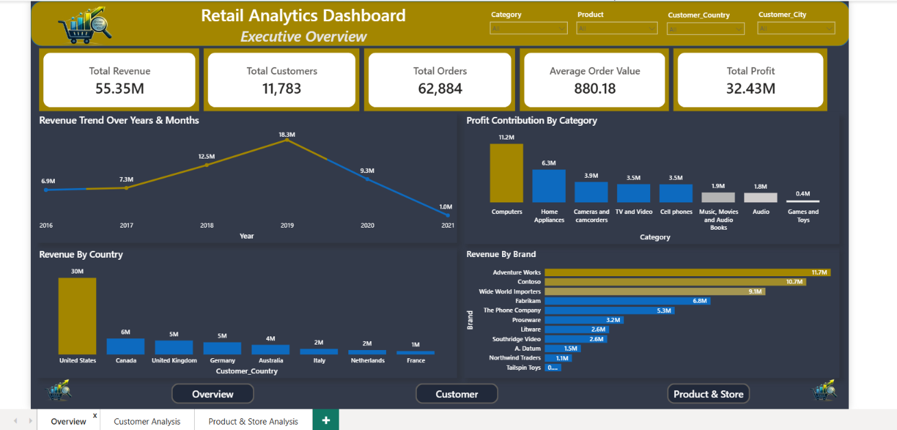
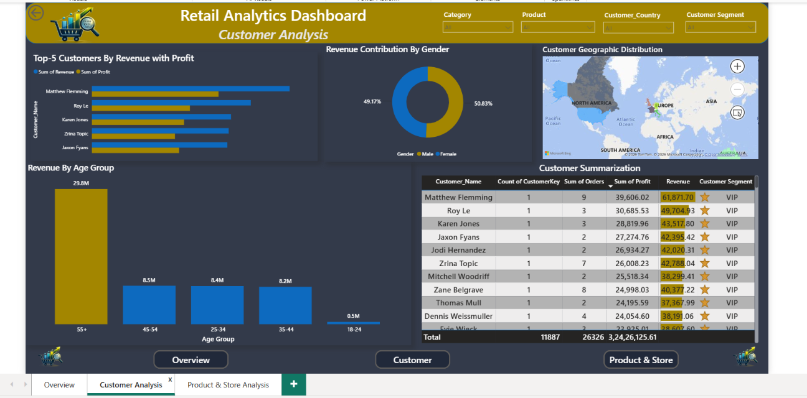
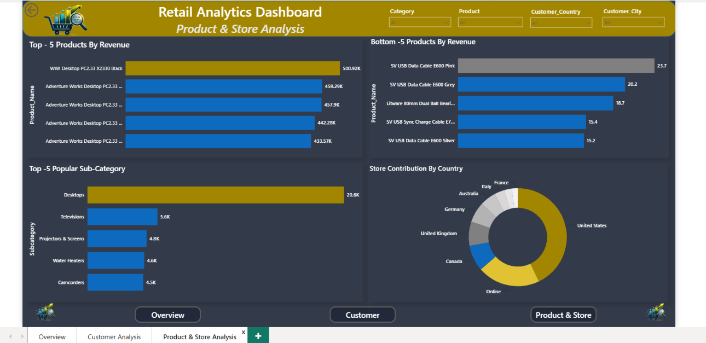

<div align="center">

#  Retail Analytics Dashboard

### End-to-End Data Analytics Project using Python, SQL Server & Power BI


</div>

---

#  Project Overview

This project presents a complete **Retail Sales Analytics Solution** built using **Python**, **SQL Server**, and **Power BI**.

The objective is to transform raw retail sales data into actionable business insights by performing data cleaning, SQL-based analysis, customer segmentation, and interactive dashboard development.

The dashboard enables business users to monitor sales performance, customer behavior, product performance, and store-level insights through an intuitive and interactive interface.

---

#  Business Objectives

- Analyze overall sales performance
- Track revenue and profit trends
- Identify top-performing products
- Understand customer purchasing behavior
- Segment customers based on business value
- Compare store performance
- Discover regional sales insights
- Support data-driven decision making

---

#  Tech Stack

| Technology | Purpose |
|------------|----------|
| Python | Data Cleaning & EDA |
| Pandas | Data Manipulation |
| Matplotlib | Data Visualization |
| SQL Server | Database & SQL Analysis |
| Power BI | Dashboard Development |
| DAX | KPIs & Customer Segmentation |

---

#  Project Workflow

```text
Raw CSV Files
      │
      ▼
Python Data Cleaning
      │
      ▼
Exploratory Data Analysis
      │
      ▼
SQL Server Database
      │
      ▼
Business SQL Queries
      │
      ▼
Power BI Data Model
      │
      ▼
Interactive Dashboard
```

---

#  Dashboard Pages

## 📈 Executive Overview

- Total Revenue
- Total Profit
- Total Orders
- Average Order Value
- Revenue Trend
- Revenue by Country
- Brand Performance
- Category Contribution

---

## 👥 Customer Analysis

- Customer Segmentation
- Customer Revenue Distribution
- Top Customers
- Revenue by Gender
- Revenue by Age Group
- Geographic Distribution
- Customer Summary Table

---

## 📦 Product & Store Analysis

- Top Products
- Bottom Products
- Category Performance
- Store Performance
- Brand Revenue
- Product Revenue Analysis

---


#  Customer Segmentation Logic

| Segment | Criteria |
|----------|----------|
| ⭐ VIP | High Revenue & Frequent Purchases |
| 🔵 Potential | Moderate Revenue & Purchase Frequency |
| ⚪ Low Value | Low Revenue & Low Purchase Frequency |

---

# 📈 Business Insights

- Generated over **55 Million** in Revenue
- Earned approximately **32 Million** in Profit
- United States contributed the highest sales
- Computers category generated maximum revenue
- Desktop products were top performers
- VIP customers contributed the largest share of revenue

---

#  Dashboard Preview

## Executive Overview

<p align="center">
  
</p>

---

## Customer Analysis

<p align="center">
  
</p>

---

## Product & Store Analysis

<p align="center">
  
</p>

---

# Repository Structure

```text
Retail-Analytics-Dashboard
│
├── Dataset
│
├── Python
│   ├── Retail_Analysis.ipynb
│   
│
├── SQL
│   ├── Data_Understanding.sql
│   ├── Business_analysis.sql
│
├── Dashboard
│   ├── Dashboard.ipbx
│   ├── Overview.png
│   ├── Customer.png
│   ├── Product.png
│
└── README.md
```

---


# Skills Demonstrated

- Data Cleaning
- Data Transformation
- Exploratory Data Analysis
- SQL Joins
- Window Functions
- CTEs
- Aggregate Functions
- Power BI
- Data Modeling
- DAX
- Dashboard Design
- Customer Segmentation
- Business Intelligence
- Data Visualization

---


### ⭐ If you found this project useful, consider giving it a Star!


</div>
